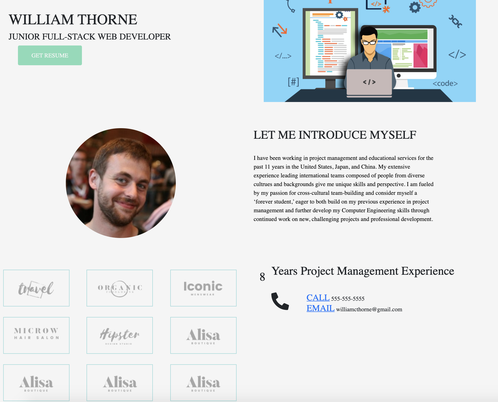

# Portfolio-2.0
Updated portfolio site for March
This is the second iteration of my personal portfolio page.

This page is made using HTML and CSS although I intend to expand functionality with Javascript functions and advanced CSS including a carousel.

Description- The website is a portfolio of my work history. Sections included are:

    Home
    About Me
    Projects
    Resume
    Additional Links

The About Me section provides information about my current experience as a student. Projects include my first group project and the second one is a weather dashboard I did for homework. The following section is a link to my resume as a pdf file (just click the file icon and you will be directed to my resume), which also includes my contact info. The last section is the footer with two icons, LinkedIn and GitHub, when you click the icons you will be direct to the my profile website.

